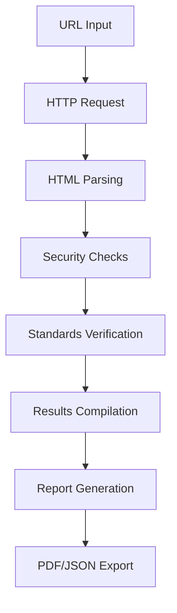

# 🔒 Checkpoint de Seguridad GCABA

[](https://python.org)
[](https://streamlit.io)
[](LICENSE)

Herramienta web interactiva para realizar chequeos previos de seguridad en aplicaciones web del Gobierno de la Ciudad Autónoma de Buenos Aires (GCABA), basada en los estándares ES0901 y ES0902.

## 📋 Descripción

Esta aplicación permite realizar un análisis automatizado de seguridad web que evalúa 14 aspectos críticos de seguridad antes del assessment formal. Está diseñada para optimizar los tiempos de evaluación y garantizar mejores despliegues de aplicaciones.

### ✨ Características Principales

- **🌐 Análisis Web Automatizado**: Evalúa aplicaciones web en tiempo real
- **📊 Dashboard Interactivo**: Interfaz intuitiva construida con Streamlit
- **📄 Generación de Informes**: Exporta resultados en PDF y JSON
- **🔍 Verificación de Estándares**: Contrasta versiones de software con estándares homologados
- **⚡ Análisis Rápido**: Resultados en pocos minutos
- **📱 Responsive**: Funciona en dispositivos móviles y escritorio

## 🛡️ Pruebas de Seguridad

La herramienta ejecuta las siguientes verificaciones:

1. **Captcha** - Implementación de CAPTCHA en formularios
2. **Validación Cliente/Servidor** - Controles de validación de entrada
3. **X-Frame-Options** - Prevención de ataques de clickjacking
4. **Ocultación de Versiones** - Verificación de divulgación de información técnica
5. **Verificación de Versiones** - Comparación con estándares homologados GCABA
6. **Validación de Sesión** - Controles de autenticación y sesiones
7. **Acceso Protegido** - Verificación de protección de URLs sensibles
8. **Validación de Archivos** - Controles de subida de archivos
9. **Mensajes de Error** - Personalización adecuada de mensajes de error
10. **Active Directory** - Integración con autenticación corporativa
11. **CORS Headers** - Configuración de políticas de origen cruzado
12. **Peticiones GET** - Análisis de recursos externos
13. **Acceso a Directorios** - Protección de rutas y archivos comunes
14. **Código Frontend** - Análisis de código del lado cliente

## 🚀 Instalación y Configuración

### Prerrequisitos

- Python 3.9 o superior
- pip (gestor de paquetes de Python)
- Conexión a internet para análisis de URLs

### Instalación Local

1. **Clonar el repositorio**:
```bash
git clone https://gitlab.gcaba.gob.ar/asi/checkpoint-seguridad.git
cd checkpoint-seguridad
```

2. **Crear entorno virtual** (recomendado):
```bash
python -m venv venv
source venv/bin/activate  # En Windows: venv\Scripts\activate
```

3. **Instalar dependencias**:
```bash
pip install -r requirements.txt
```

4. **Ejecutar la aplicación**:
```bash
streamlit run app.py
```

5. **Abrir en el navegador**:
```
http://localhost:8501
```

### Instalación con Docker

```bash
# Construir la imagen
docker build -t checkpoint-seguridad .

# Ejecutar el contenedor
docker run -p 8501:8501 checkpoint-seguridad
```

## 📖 Uso de la Aplicación

### Análisis Básico

1. **Acceder a la aplicación** en `http://localhost:8501`
2. **Completar información del proyecto** en la barra lateral:
   - Nombre del proyecto
   - Email del autor
   - Ticket JIRA (opcional)
   - Versión

3. **Ingresar la URL** de la aplicación a analizar
4. **Ejecutar análisis** haciendo clic en "🔍 Ejecutar Análisis de Seguridad"
5. **Revisar resultados** en las diferentes pestañas

### Configuración de Estándares

La aplicación permite tres opciones para la verificación de estándares:

- **Estándar predeterminado**: Utiliza las versiones homologadas según ES0901 v4.7
- **Archivo personalizado**: Cargar un archivo .txt con versiones específicas
- **Descarga automática**: Obtener la versión más reciente desde el sitio oficial

### Exportación de Resultados

- **📄 PDF**: Informe completo con formato oficial GCABA
- **📊 JSON**: Datos estructurados para integración con otros sistemas

## 🔧 Configuración Avanzada

### Archivo de Estándares Personalizado

Crear un archivo `standar.txt` con el formato:

```
software:version1,version2,version3
jquery:3.6.4,3.7.0,3.7.1
bootstrap:5.3.0,5.3.1,5.3.2
angular:17.3.12,18.2.6
```

### Variables de Entorno

```bash
# Opcional: configurar timeout para requests
export CHECKPOINT_TIMEOUT=30

# Opcional: habilitar modo debug
export CHECKPOINT_DEBUG=true
```

## 📁 Estructura del Proyecto

```
checkpoint-seguridad/
├── app.py                 # Aplicación principal Streamlit
├── estandar.py           # Módulo de verificación de estándares
├── requirements.txt      # Dependencias Python
├── README.md            # Documentación
├── .gitignore           # Archivos ignorados por Git
├── Dockerfile           # Configuración Docker
├── docker-compose.yml   # Orquestación Docker
├── config/
│   └── standar.txt      # Archivo de estándares (opcional)
├── docs/
│   ├── user-guide.md    # Guía de usuario
│   └── api-reference.md # Referencia API
└── tests/
    ├── test_estandar.py # Pruebas unitarias
    └── test_app.py      # Pruebas de integración
```

## 🧪 Pruebas

### Ejecutar Pruebas Unitarias

```bash
# Instalar dependencias de desarrollo
pip install pytest pytest-cov

# Ejecutar todas las pruebas
pytest

# Ejecutar con cobertura
pytest --cov=. --cov-report=html
```

### Pruebas Manuales

```bash
# Probar módulo de estándares
python estandar.py

# Probar aplicación con datos de ejemplo
streamlit run app.py
```

## 🚢 Despliegue

### Streamlit Cloud

1. Hacer fork del repositorio en GitHub
2. Conectar con Streamlit Cloud
3. Configurar variables de entorno si es necesario
4. Desplegar automáticamente

### Servidor Local (Producción)

```bash
# Usar un servidor WSGI como Gunicorn (requiere configuración adicional)
pip install gunicorn
gunicorn --bind 0.0.0.0:8501 app:app
```

### Docker Compose

```bash
# Levantar todos los servicios
docker-compose up -d

# Ver logs
docker-compose logs -f

# Detener servicios
docker-compose down
```

## 🔒 Seguridad

### Consideraciones de Seguridad

- La aplicación **NO almacena** datos sensibles de las URLs analizadas
- Los análisis se realizan en tiempo real sin persistencia
- Se recomienda usar HTTPS en producción
- Implementar autenticación corporativa si es necesario

### Limitaciones

- Timeout de 30 segundos por análisis
- Análisis limitado a URLs públicamente accesibles
- No realiza pruebas invasivas de penetración

## 📚 Documentación de Referencia

### Estándares GCABA

- **[ES0901 - Estándar de Desarrollo](https://buenosaires.gob.ar/agencia-de-sistemas-de-informacion/estandares-de-la-agencia)**
- **[ES0902 - Estándar de Seguridad](https://buenosaires.gob.ar/agencia-de-sistemas-de-informacion/estandares-de-la-agencia)**
- **[Sistema de Diseño Obelisco](https://gcba.github.io/estandares/)**

### Guías de Seguridad

- [OWASP Top 10](https://owasp.org/www-project-top-ten/)
- [Guía de Seguridad Web MDN](https://developer.mozilla.org/en-US/docs/Web/Security)
- [Checkpoint de Seguridad GCABA](https://buenosaires.gob.ar/agencia-de-sistemas-de-informacion)

## 🤝 Contribución

### Cómo Contribuir

1. **Fork** el proyecto
2. **Crear** una rama para tu feature (`git checkout -b feature/nueva-funcionalidad`)
3. **Commit** tus cambios (`git commit -am 'Agregar nueva funcionalidad'`)
4. **Push** a la rama (`git push origin feature/nueva-funcionalidad`)
5. **Crear** un Pull Request

### Reporte de Bugs

Usar el sistema de issues de GitLab con la siguiente información:

- Descripción del problema
- Pasos para reproducir
- Comportamiento esperado vs actual
- Screenshots si aplica
- Información del entorno (OS, Python version, etc.)

### Solicitud de Features

- Describir la funcionalidad solicitada
- Justificar la necesidad
- Proporcionar ejemplos de uso
- Considerar impacto en performance

## 📞 Soporte

### Contacto

- **Mesa de Ayuda ASI**: [mesa-ayuda@buenosaires.gob.ar](mailto:mesa-ayuda@buenosaires.gob.ar)
- **Documentación**: [Confluence GCABA](https://confluence.gcaba.gob.ar)
- **Issues**: [GitLab Issues](https://gitlab.gcaba.gob.ar/asi/checkpoint-seguridad/-/issues)

### FAQ

**P: ¿La herramienta funciona con aplicaciones internas?**
R: Sí, siempre que sean accesibles desde la red donde se ejecuta la herramienta.

**P: ¿Puedo analizar múltiples URLs a la vez?**
R: Actualmente no, pero está planificado para futuras versiones.

**P: ¿Los resultados son vinculantes para el assessment oficial?**
R: No, esta es una herramienta de pre-evaluación. El assessment oficial sigue siendo obligatorio.

## 📄 Licencia

Este proyecto está licenciado bajo los términos de la Agencia de Sistemas de Información del GCABA.

## 🏗️ Arquitectura Técnica

### Stack Tecnológico

- **Frontend**: Streamlit (Python)
- **Backend**: Python 3.9+
- **Análisis Web**: urllib, requests, html.parser
- **Generación PDF**: ReportLab
- **Visualización**: Matplotlib
- **Contenedores**: Docker

### Flujo de Análisis



## 🔄 Changelog

### v2.0.2 (2025-01-01)
- ✨ Interfaz Streamlit completamente nueva
- 📊 Dashboard interactivo con métricas
- 📄 Generación de informes PDF y JSON
- 🔍 Verificación automática de estándares ES0901
- 🐛 Corrección de bugs en detección de versiones

### v2.0.1 (2024-12-15)
- 🔧 Mejoras en la detección de CAPTCHA
- 📈 Optimización de performance
- 🛡️ Actualización de patrones de seguridad

### v2.0.0 (2024-12-01)
- 🚀 Migración completa a Streamlit
- 🏗️ Refactorización de arquitectura
- 📚 Documentación completa

---

**Desarrollado por la Agencia de Sistemas de Información - GCABA**

*Última actualización: Enero 2025*
